# master_plan - State Management

## Praktikum 1 - Praktikum 1: Dasar State dengan Model-View

Langkah 1: Buat Project Baru

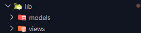

Langkah 2: Membuat model task.dart

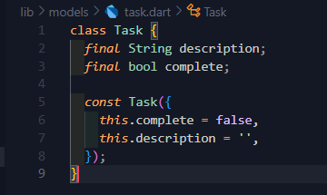

Langkah 3: Buat file plan.dart

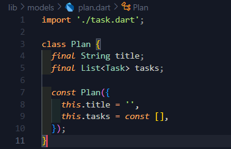

Langkah 4: Buat file data_layer.dart

Langkah 5: Pindah ke file main.dart

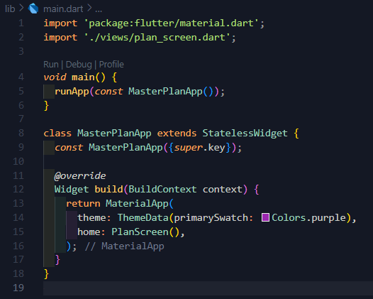

kita perlu menambahkan useMaterial3:false agar primarySwatch bisa berfungsi dengan baik

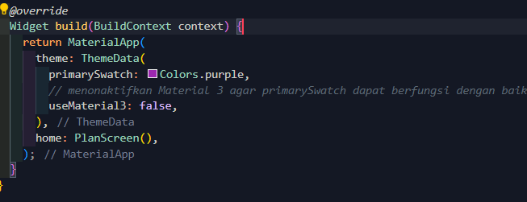

Langkah 6: buat plan_screen.dart

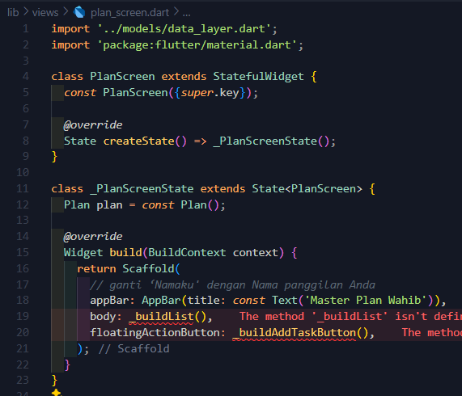

Langkah 7: buat method _buildAddTaskButton()

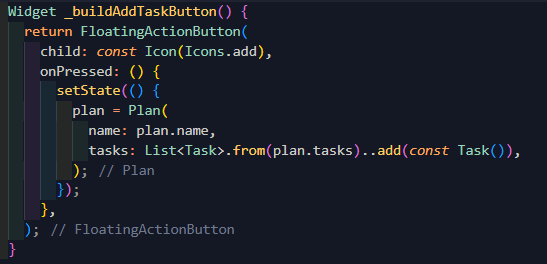

Langkah 8: buat widget _buildList()

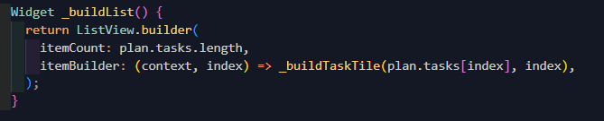

Langkah 9: buat widget _buildTaskTile

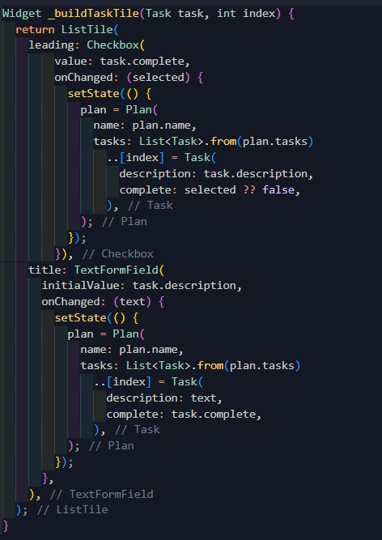

Langkah 10: Tambah Scroll Controller

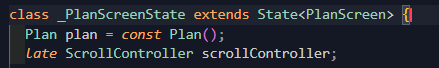

Langkah 11: Tambah Scroll Listener

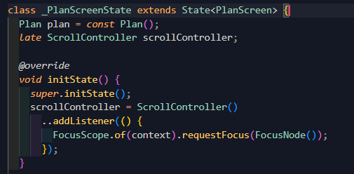

Langkah 12: Tambah controller dan keyboard behavior

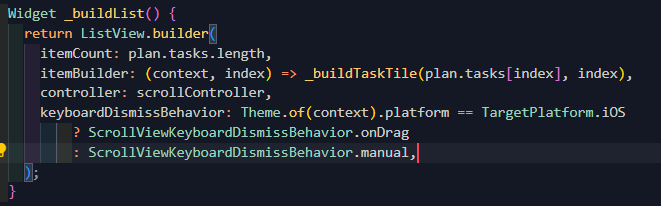

Langkah 13: Terakhir, tambah method dispose()

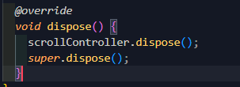

Langkah 14: Hasil

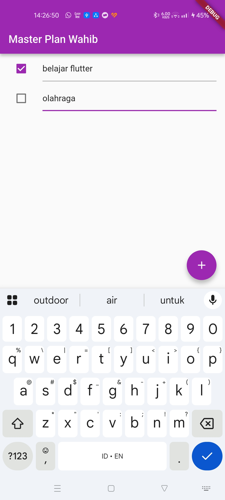

___

## Tugas Praktikum 1: 

1. Selesaikan langkah-langkah praktikum tersebut, lalu dokumentasikan berupa GIF hasil akhir praktikum beserta penjelasannya di file README.md! Jika Anda menemukan ada yang error atau tidak berjalan dengan baik, silakan diperbaiki.

2. Jelaskan maksud dari langkah 4 pada praktikum tersebut! Mengapa dilakukan demikian?

Langkah tersebut digunakan untuk menyatukan akses ke file `plan.dart & task.dart`. 
Hal ini dilakukan agar kita tidak perlu mengimport masing-masing file, namun kita hanya perlu mengimport `data_layer.dart` saja untuk mengakses kedua file tersebut 

3. Mengapa perlu variabel plan di langkah 6 pada praktikum tersebut? Mengapa dibuat konstanta ?

Variabel tersebut digunakan untuk menyimpan dan mengelola data inputan (plan) yang akan digunakan pada planScreen.dart. Variabel tersebut juga dibuat constant karena pada tahap awal, data masih kosong yang berarti Flutter tidak perlu membuat ulang objek setiap kali widget dijalankan.

4. Lakukan capture hasil dari Langkah 9 berupa GIF, kemudian jelaskan apa yang telah Anda buat!

Fungsi _buildTaskTile() akan membuat satu baris daftar tugas yang bisa diedit teksnya dan bisa ditandai selesai, lalu jika ada perubahan, maka langsung diperbarui ke dalam plan dan tampilan layar.

5. Apa kegunaan method pada Langkah 11 dan 13 dalam lifecyle state ?

- Method initState digunakan untuk menginisialisasi variabel, listener, controller, dsb. Didalam state yang kita gunakan terdapat kode `FocusScope.of(context).requestFocus(FocusNode());` yang berfungsi untuk menutup keyboard pada saat setiap kali user melakukan scroll di aplikasi.

- Method  dispose digunakan untuk membersihkan resource agar tidak terjadi penggunaan memori yang berlebihan.

6. Kumpulkan laporan praktikum Anda berupa link commit atau repository GitHub ke dosen yang telah disepakati !

___

## Praktikum 2 - Mengelola Data Layer dengan InheritedWidget dan InheritedNotifier

Langkah 1: Buat file plan_provider.dart

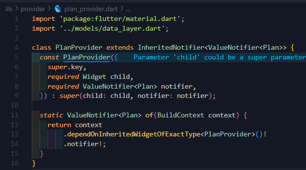

Langkah 2: Edit main.dart

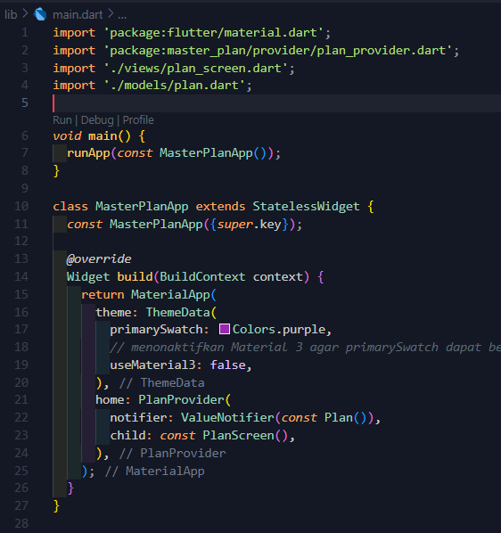

Langkah 3: Tambah method pada model plan.dart

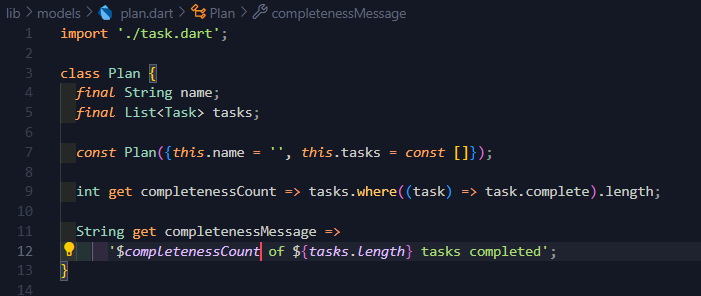

Langkah 4: Pindah ke PlanScreen

Langkah 5: Edit method _buildAddTaskButton

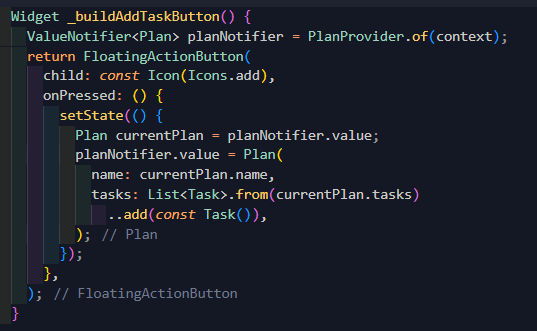

Langkah 6: Edit method _buildTaskTile

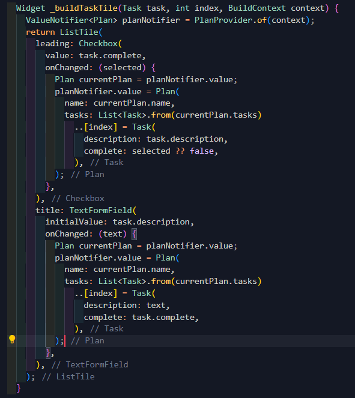

Langkah 7: Edit _buildList

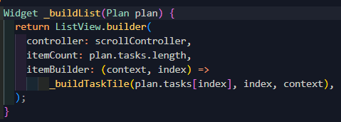

Langkah 8: Tetap di class PlanScreen

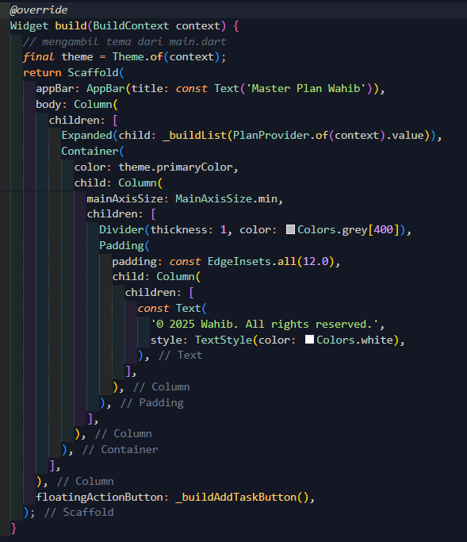

Langkah 9: Tambah widget SafeArea

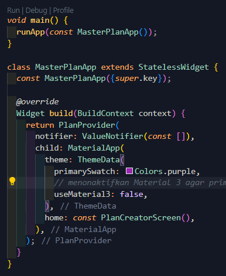

Hasil: 

## Tugas Praktikum 2:

1. Selesaikan langkah-langkah praktikum tersebut, lalu dokumentasikan berupa GIF hasil akhir praktikum beserta penjelasannya di file README.md! Jika Anda menemukan ada yang error atau tidak berjalan dengan baik, silakan diperbaiki sesuai dengan tujuan aplikasi tersebut dibuat.

2. Jelaskan mana yang dimaksud InheritedWidget pada langkah 1 tersebut! Mengapa yang digunakan InheritedNotifier?

Pada langkah tersebut, yang dimaksud dengan **InheritedWidget** adalah konsep dasar Flutter untuk membagikan data ke seluruh widget di bawahnya dalam tree tanpa harus mengoper data melalui constructor, namun pada praktikum 3 kita menggunakan **InheritedNotifier** karena memang merupakan turunan dari InheritedWidget yang sudah terhubung dengan **ValueNotifier**, sehingga ketika data Plan berubah dan ValueNotifier memanggil `notifyListeners()`, widget lain yang bergantung pada provider akan otomatis rebuild ulang. Hal ini membuat state menjadi aktif dan jauh lebih efisien dibanding InheritedWidget biasa yang tidak memiliki kemampuan notifikasi perubahan.

3. Jelaskan maksud dari method di langkah 3 pada praktikum tersebut! Mengapa dilakukan demikian?

Method tersebut akan menghitung jumlah tasks yang sudah selesai dan menghasilkan pesan progres secara otomatis. Getter `completedCount` akan memfilter daftar tasks dan menghitung ada berapa banyak yang memiliki complete == true. Sedangkan `completenessmessage` akan mengembalikan teks, sehingga setiap kali daftar task berubah informasi progres akan menampilkan hasil secara real time.

4. Lakukan capture hasil dari Langkah 9 berupa GIF, kemudian jelaskan apa yang telah Anda buat!

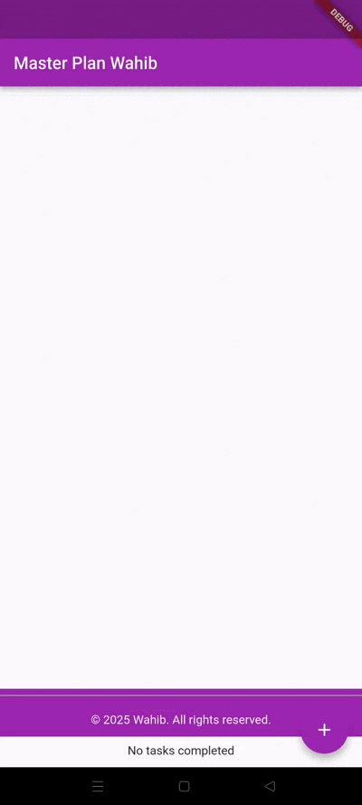

5. Kumpulkan laporan praktikum Anda berupa link commit atau repository GitHub ke dosen yang telah disepakati !

## Praktikum 3: Membuat State di Multiple Screens

Langkah 1: Edit PlanProvider

Langkah 2: Edit main.dart

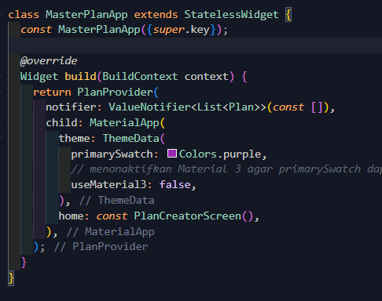

Langkah 3: Edit plan_screen.dart

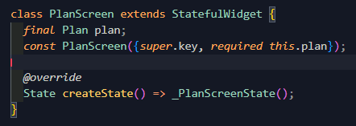

Langkah 4: Error

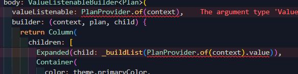

Langkah 5: Tambah getter Plan

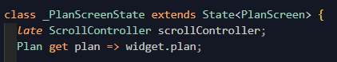

Langkah 6: Method initState()

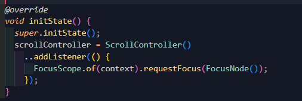

Langkah 7: Widget build

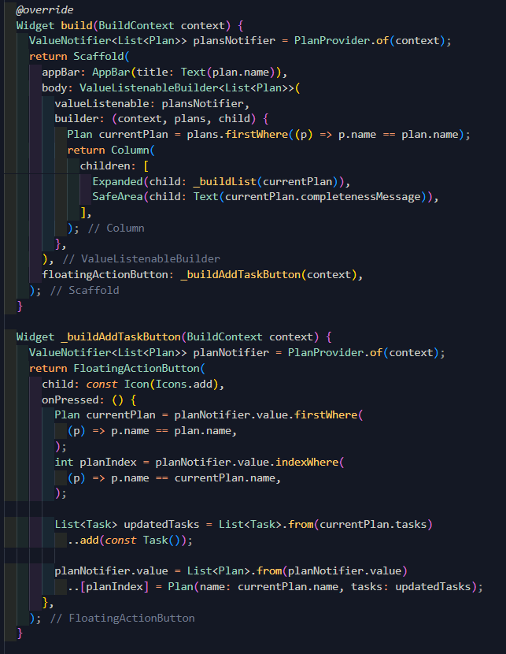

Langkah 8: Edit _buildTaskTile 

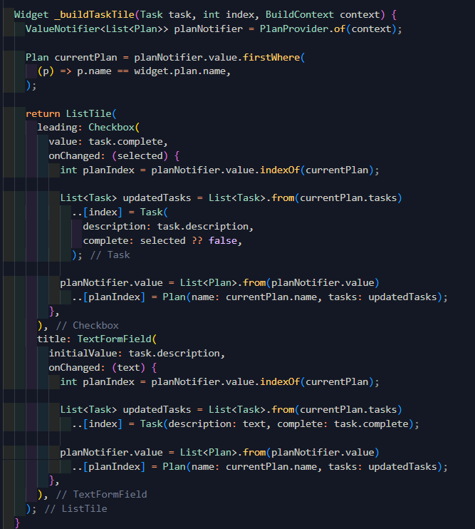

Langkah 9: Buat screen baru 

Langkah 10: Pindah ke class _PlanCreatorScreenState 

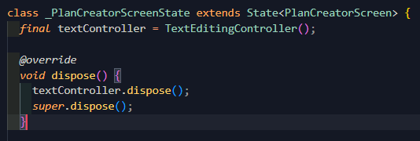

Langkah  11: Pindah ke method build 

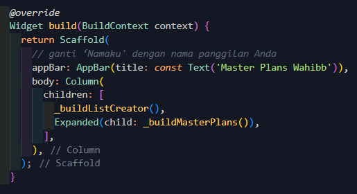

Langkah 12: Buat widget _buildListCreator 

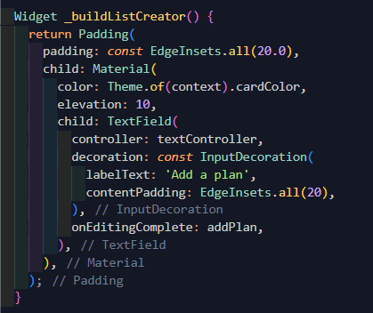

Langkah 13: Buat  void addPlan() 

Langkah 14: Buat widget _buildMasterPlans()

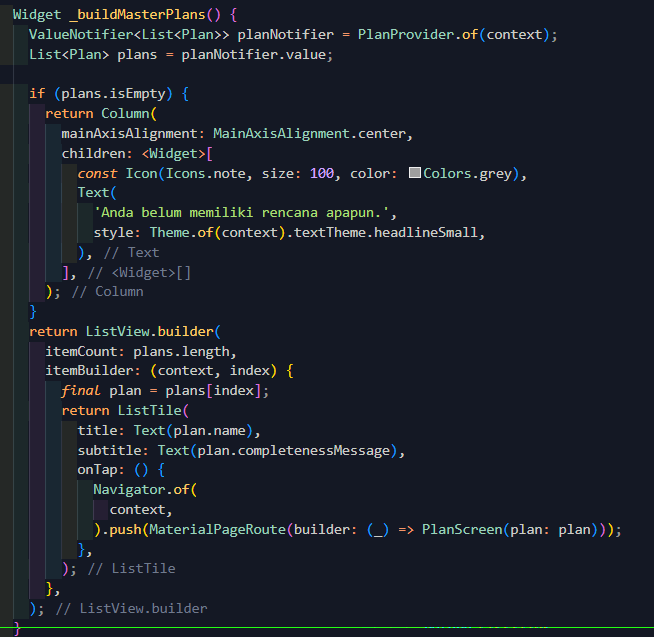

Hasil:

## Tugas Praktikum 3 :

1. Selesaikan langkah-langkah praktikum tersebut, lalu dokumentasikan berupa GIF hasil akhir praktikum beserta penjelasannya di file README.md! Jika Anda menemukan ada yang error atau tidak berjalan dengan baik, silakan diperbaiki sesuai dengan tujuan aplikasi tersebut dibuat.

2. Berdasarkan Praktikum 3 yang telah Anda lakukan, jelaskan maksud dari gambar diagram berikut ini!

Gambar tersebut menjelaskan bahwa di dalam aplikasi plan_master terdapat 2 struktur widget tree pada saat sebelum dan sesudah proses Navigator.push(). 

Pada diagram sisi kiri terlihat bahwa aplikasi pada awalnya berada pada halaman `PlanCreatorScreen` yang menampilkan `TextField` dan `ListView` dalam sebuah `Column`. Data pada tree tersebut dikelola oleh `PlanProvider` yang menjadi widget paling atas setelah `MaterialAPP`.

Ketika pengguna menekan rencana yang telah dibuat pada halaman `PlanCreatorScreen` maka aplikasi akan melakukan `Navigator.push()` yang akan memindahkan pengguna ke halaman baru yaitu `PlanScreen` (diagram sisi kiri). 
Halaman baru tersebut juga memiliki struktur yang berbeda yaitu adanya `ListView` untuk menampilkan daftar tugas yang dibungkus di  dalam `Expanded`, sementara pesan progres ditampilkan di bagian bawah menggunakan `SafeArea` agar aman dari area sistem (seperti notch atau gesture bar).

Diagram tersebut menunjukkan bahwa setelah berpindah halaman, tampilan UI akan berubah dari yang awalnya form input menjadi tampilan hasil rencana, namun hal tersebut tetap berada dalam satu `MaterialApp` dan tetap menggunakan data yang disediakan oleh `PlanProvider`.

3. Lakukan capture hasil dari Langkah 14 berupa GIF, kemudian jelaskan apa yang telah Anda buat!

Aplikasi sederhana yang telah saya buat adalah aplikasi yang membantu pengguna dalam membuat daftar rencana serta dapat melihat progresnya.

Aplikasi tersebut memiliki 2 model yaitu `Plan` dan `Task`

`PlanProvider` menggunakan `InheritedNotifier` agar data plan dapat digunakan di seluruh widget dan otomatis memperbarui ketika data berubah. 

 `PlanScreen` yang menampilkan daftar tugas menggunakan `ListView`, memungkinkan pengguna menambah task lewat `FloatingActionButton`, mengubah teks task, menandai task selesai melalui Checkbox, dan menghitung progres secara otomatis menggunakan getter `completedCount` dan `completenessMessage`. 

Pada bagian bawah layar, terdapat `SafeArea` yang menampilkan pesan progres seperti “3 out of 5 tasks”.

 Secara keseluruhan, praktikum ini merupakan implementasi state management sederhana, navigasi, layout widget, dan tampilan yang dinamis berbasis data.

4. Kumpulkan laporan praktikum Anda berupa link commit atau repository GitHub ke dosen yang telah disepakati !