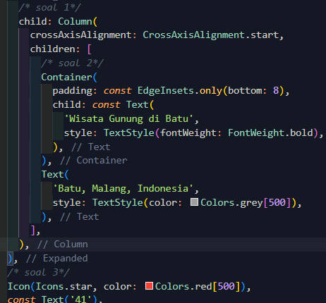
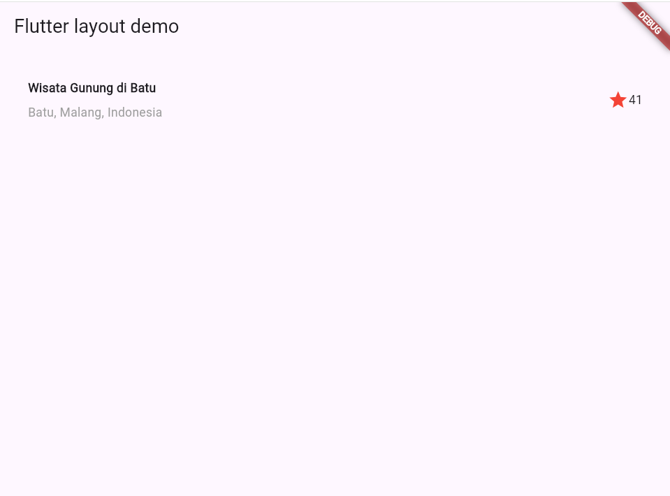
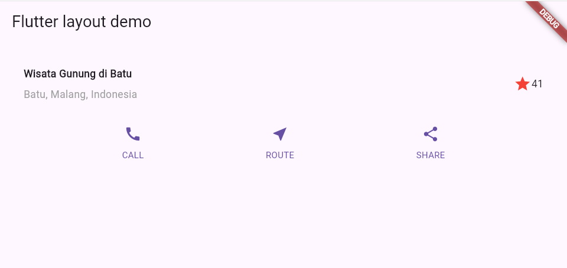
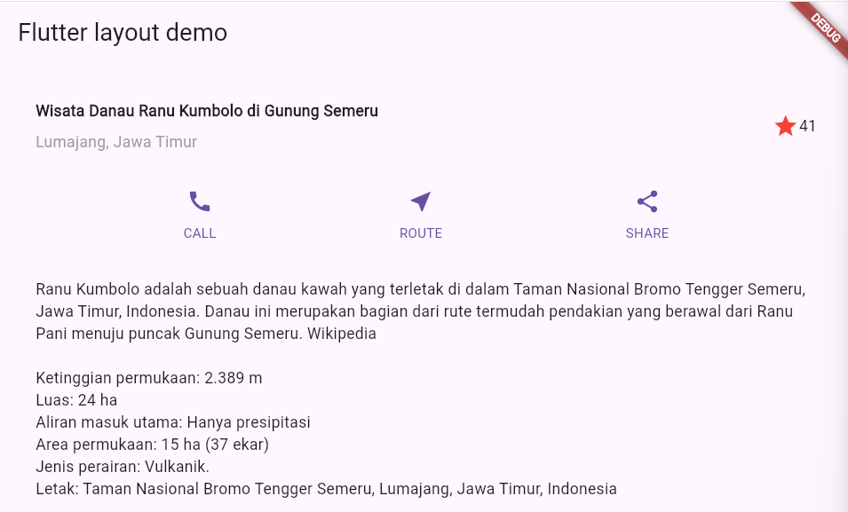
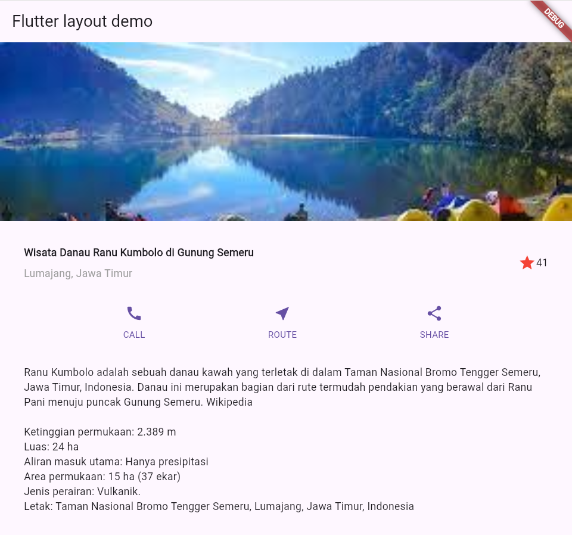
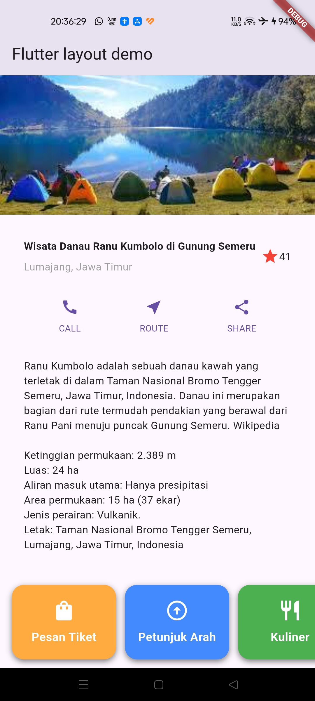

# Praktikum 1: Membangun Layout di Flutter
__Soal:__
1. Letakkan widget Column di dalam widget Expanded agar menyesuaikan ruang yang tersisa di dalam widget Row. Tambahkan properti crossAxisAlignment ke CrossAxisAlignment.start sehingga posisi kolom berada di awal baris.

2. Letakkan baris pertama teks di dalam Container sehingga memungkinkan Anda untuk menambahkan padding = 8. Teks ‘Batu, Malang, Indonesia' di dalam Column, set warna menjadi abu-abu.

3. Dua item terakhir di baris judul adalah ikon bintang, set dengan warna merah, dan teks "41". Seluruh baris ada di dalam Container dan beri padding di sepanjang setiap tepinya sebesar 32 piksel.

__Jawaban:__

**Hasil:**

# Praktikum 2: Implementasi button row
**Hasil:**

# Praktikum 3: Implementasi text section
**Hasil:**

# Praktikum 4: Implementasi image section
**Hasil:**

# Tugas Praktikum 1:
1. Selesaikan Praktikum 1 sampai 4, lalu dokumentasikan dan push ke repository Anda berupa screenshot setiap hasil pekerjaan beserta penjelasannya di file README.md!
2. Silakan implementasikan di project baru "basic_layout_flutter" dengan mengakses sumber ini: https://docs.flutter.dev/codelabs/layout-basics

**Menambahkan horizontal list:**

3. Kumpulkan link commit repository GitHub Anda kepada dosen yang telah disepakati!
