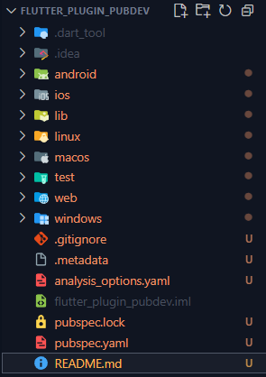

# flutter_plugin_pubdev

Menerapkan Plugin auto_size_text di Project Flutter


## Langkah 1: Buat Project Baru
Buatlah sebuah project flutter baru dengan nama flutter_plugin_pubdev. Lalu jadikan repository di GitHub Anda dengan nama flutter_plugin_pubdev.



## Langkah 2: Menambahkan Plugin
Tambahkan plugin auto_size_text menggunakan perintah berikut di terminal
```flutter pub add auto_size_text```
Jika berhasil, maka akan tampil nama plugin beserta versinya di file pubspec.yaml pada bagian dependencies.


## Langkah 3: Buat file red_text_widget.dart
Buat file baru bernama red_text_widget.dart di dalam folder lib lalu isi kode seperti berikut.

```import 'package:flutter/material.dart';

class RedTextWidget extends StatelessWidget {
  const RedTextWidget({Key? key}) : super(key: key);

  @override
  Widget build(BuildContext context) {
    return Container();
  }
}
```


## Langkah 4: Tambah Widget AutoSizeText
Masih di file red_text_widget.dart, untuk menggunakan plugin auto_size_text, ubahlah kode return Container() menjadi seperti berikut.

```return AutoSizeText(
      text,
      style: const TextStyle(color: Colors.red, fontSize: 14),
      maxLines: 2,
      overflow: TextOverflow.ellipsis,
);
```

Setelah Anda menambahkan kode di atas, Anda akan mendapatkan info error. Mengapa demikian? Jelaskan dalam laporan praktikum Anda!


Karena plugin/library AutoSizeText belum di import ke dalam file tersebut. Berikut hasilnya setelah diperbaiki:


## Langkah 5: Buat Variabel text dan parameter di constructor
Tambahkan variabel text dan parameter di constructor seperti berikut.

```final String text;

const RedTextWidget({Key? key, required this.text}) : super(key: key);
```


## Langkah 6: Tambahkan widget di main.dart
Buka file main.dart lalu tambahkan di dalam children: pada class _MyHomePageState
```
Container(
   color: Colors.yellowAccent,
   width: 50,
   child: const RedTextWidget(
             text: 'You have pushed the button this many times:',
          ),
),
Container(
    color: Colors.greenAccent,
    width: 100,
    child: const Text(
           'You have pushed the button this many times:',
          ),
),
```


## Run aplikasi tersebut dengan tekan F5


# Tugas Praktikum
## 1. Selesaikan Praktikum tersebut, lalu dokumentasikan dan push ke repository Anda berupa 
screenshot hasil pekerjaan beserta penjelasannya di file README.md!

## 2. Jelaskan maksud dari langkah 2 pada praktikum tersebut!

Kode ```flutter pub add auto_size_text``` dijalankan di terminal yang berfungsi untuk menambahkan plugin auto_size_text ke dalam project ini. Dan akan tampil di dalam file pubspec.yaml di bagian dependencies.

## 3. Jelaskan maksud dari langkah 5 pada praktikum tersebut!

Kode tersebut akan membuat variabel final bertipe String dengan nama text. lalu pada constructor RedTextWidget akan membuat blue print widget/objek dengan parameter key, (opsional) dan text (wajib).

## 4. Pada langkah 6 terdapat dua widget yang ditambahkan, jelaskan fungsi dan perbedaannya!

Widget yang pertama akan membuat child dengan tipe RedTextWidget (yang baru saja kita buat) dengan parameter text, yang berfungsi untuk menampilkan teks dengan warna **merah**.

Sedangkan widget kedua akan membuat child dengan tipe Text, yaitu widget bawaan dari Flutter, untuk menampilkan teks yang sama.

## 5. Jelaskan maksud dari tiap parameter yang ada di dalam plugin auto_size_text berdasarkan tautan pada dokumentasi ini !

### Penjelasan Parameter `AutoSizeText`

Berikut adalah rincian setiap parameter, dikelompokkan berdasarkan fungsinya 

#### Parameter Utama

| Parameter     | Tipe Data      | Penjelasan                                                                                       |
| :------------ | :------------- | :--------------------------------------------------------------------------------------------------------- |
| `text`        | `String`       | **Wajib diisi**. Teks yang ingin ditampilkan.                                                           |
| `style`       | `TextStyle`    | Untuk mengatur gaya teks seperti **warna, ketebalan, jenis font, dll.**, sama seperti pada widget `Text` biasa. |
| `textAlign`   | `TextAlign`    | Mengatur **perataan teks** secara horizontal (kiri, kanan, tengah, atau rata kiri-kanan).                  |
| `textDirection` | `TextDirection`| Mengatur **arah teks** (kiri-ke-kanan atau kanan-ke-kiri).    |
| `maxLines`    | `int`          | Jumlah **baris maksimum** yang diizinkan untuk teks. Plugin akan mencoba menyesuaikan ukuran font agar pas dalam jumlah baris ini. |

---

#### Parameter untuk Auto-Sizing 

| Parameter          | Tipe Data         | Penjelasan                                                                                                                                                                                          |
| :----------------- | :---------------- | :------------------------------------------------------------------------------------------------------------------------------------------------------------------------------------------------------------ |
| `minFontSize`      | `double`          | Ukuran font **paling kecil** yang diizinkan. Teks tidak akan pernah menyusut lebih kecil dari nilai ini. (Default: 12)                                                                                       |
| `maxFontSize`      | `double`          | Ukuran font **paling besar** yang diizinkan. Teks tidak akan membesar melebihi nilai ini. (Default: `double.infinity`)                                                                                      |
| `stepGranularity`  | `double`          | **"Langkah" pengecilan** ukuran font. Jika ukurannya 30 dan `stepGranularity` adalah 2, maka plugin akan mencoba ukuran 30, lalu 28, 26, dst, sampai pas. (Default: 1)                                            |
| `presetFontSizes`  | `List<double>`    | Daftar **ukuran font yang sudah ditentukan**. Plugin hanya akan mencoba ukuran yang ada di daftar ini, dan akan mengabaikan `minFontSize`, `maxFontSize`, dan `stepGranularity`.|
| `group`            | `AutoSizeGroup`   | Digunakan untuk **menyamakan ukuran font** beberapa widget `AutoSizeText` yang berbeda. Semua widget dengan `group` yang sama akan memiliki ukuran font yang sama (mengikuti ukuran font terkecil di antara semuanya agar semua muat). |

---

#### Parameter untuk Penanganan Overflow & Wrap

| Parameter            | Tipe Data | Penjelasan                                                                                                                                        |
| :------------------- | :-------- | :---------------------------------------------------------------------------------------------------------------------------------------------------------- |
| `overflow`           | `TextOverflow` | Menentukan apa yang terjadi jika teks **tetap tidak muat** bahkan setelah ukurannya diminimalkan. Pilihan umum: `ellipsis` (menampilkan `...`), `clip` (memotong), atau `visible` (tetap ditampilkan walau keluar batas). |
| `overflowReplacement`| `Widget`  | Widget yang akan **ditampilkan sebagai pengganti**  jika teksnya *overflow* (tidak muat sama sekali). Berguna untuk menampilkan pesan atau ikon.             |
| `softWrap`           | `bool`    | Jika `true`, teks akan **pindah ke baris baru** secara otomatis jika tidak muat. Jika `false`, teks akan terus memanjang di satu baris. (Default: `true`)      |
| `wrapWords`          | `bool`    | Mengatur apakah teks harus **dipotong per kata**. `true` (default) akan memindahkan seluruh kata ke baris baru. `false` bisa memotong kata di tengah jika diperlukan. |

---

#### Parameter Teknis & Aksesibilitas

| Parameter         | Tipe Data | Penjelasan                                                                                                                                      |
| :---------------- | :-------- | :-------------------------------------------------------------------------------------------------------------------------------------------------------- |
| `key`             | `Key`     | Sebagai **identitas unik** untuk widget `AutoSizeText`. Berguna saat widget berada di dalam daftar yang bisa berubah urutan.                              |
| `textKey`         | `Key`     | Memberikan `Key` khusus **hanya untuk widget `Text` internal** yang dibuat oleh `AutoSizeText`. |
| `locale`          | `Locale`  | Untuk memilih font yang tepat ketika sebuah karakter bisa ditampilkan berbeda tergantung **bahasa atau negara** (misal, karakter Hanzi di Jepang vs. Cina). |
| `textScaleFactor` | `double`  | Faktor pengali ukuran font. Biasanya mengikuti **pengaturan ukuran font dari sistem operasi** pengguna untuk aksesibilitas.                               |
| `semanticsLabel`  | `String`  | Teks alternatif yang akan **dibacakan oleh screen reader** 🔊. Berguna untuk pengguna dengan gangguan penglihatan.                                        |

## 6. Kumpulkan laporan praktikum Anda berupa link repository GitHub kepada dosen!
