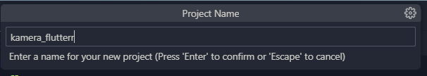
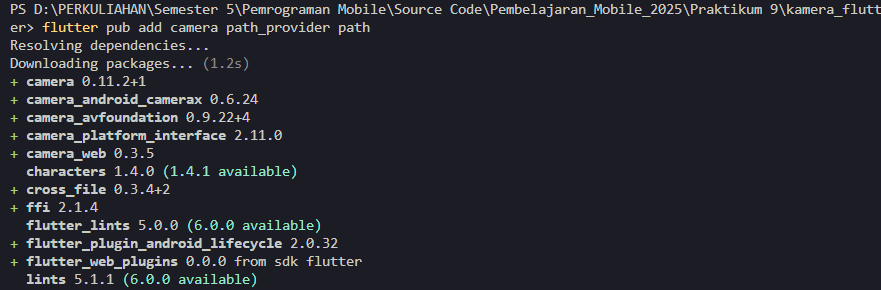
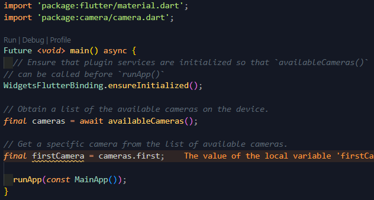
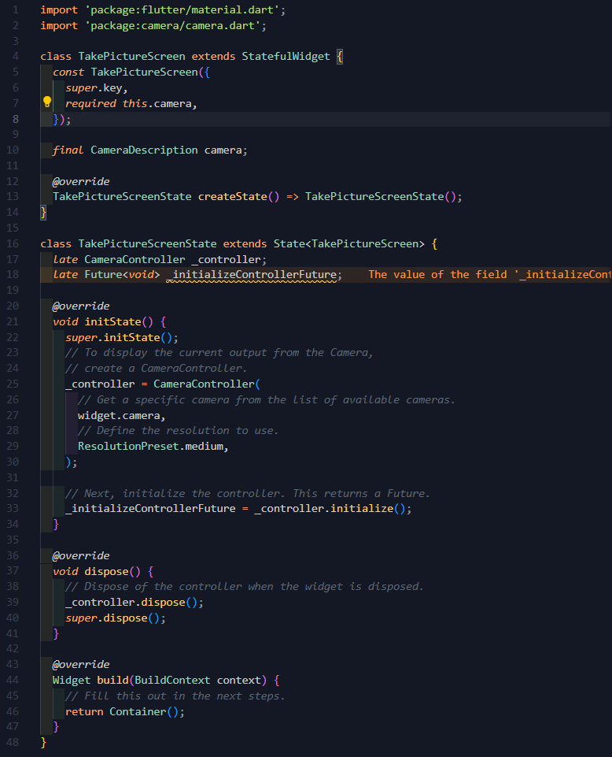
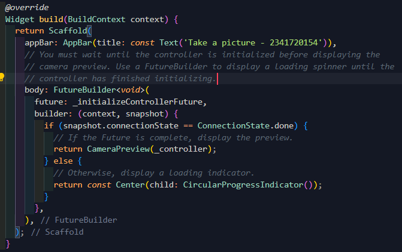
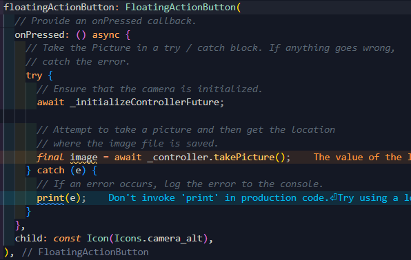
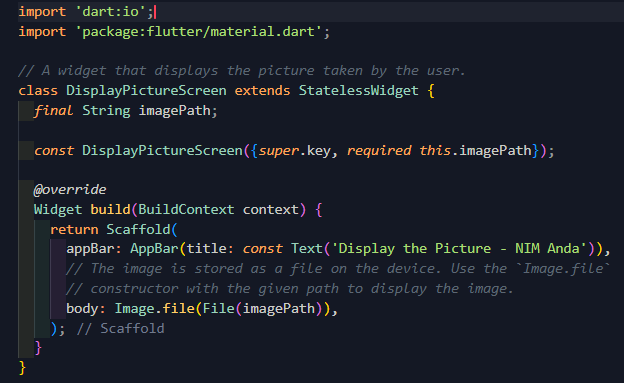
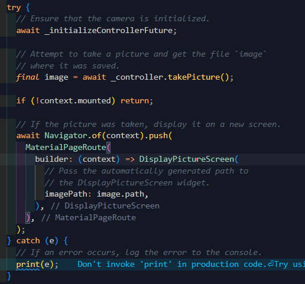

# kamera_flutter

Mengambil Foto dengan Kamera di Flutter

Langkah-langkah:

1. Membuat Project baru

2. Tambah dependensi yang diperlukan

3. Ambil Sensor Kamera dari device

4. Buat dan inisialisasi CameraController

5. Gunakan CameraPreview untuk menampilkan preview foto

6. Ambil foto dengan CameraController

7. Buat widget baru DisplayPictureScreen

8. Edit main.dart

9. Menampilkan hasil foto

**Hasil:**

Mengambil gambar

Menampilkan gambar

