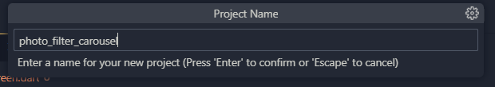
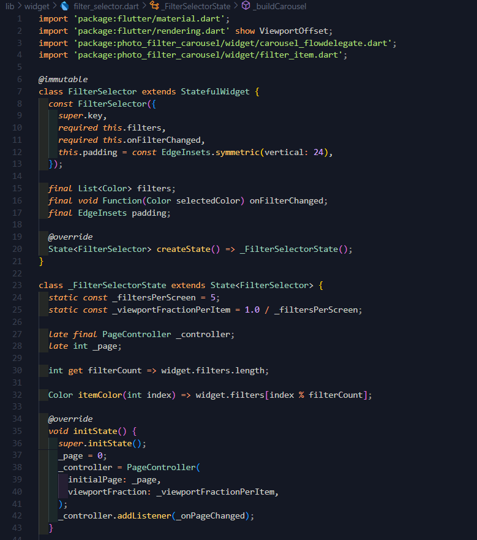
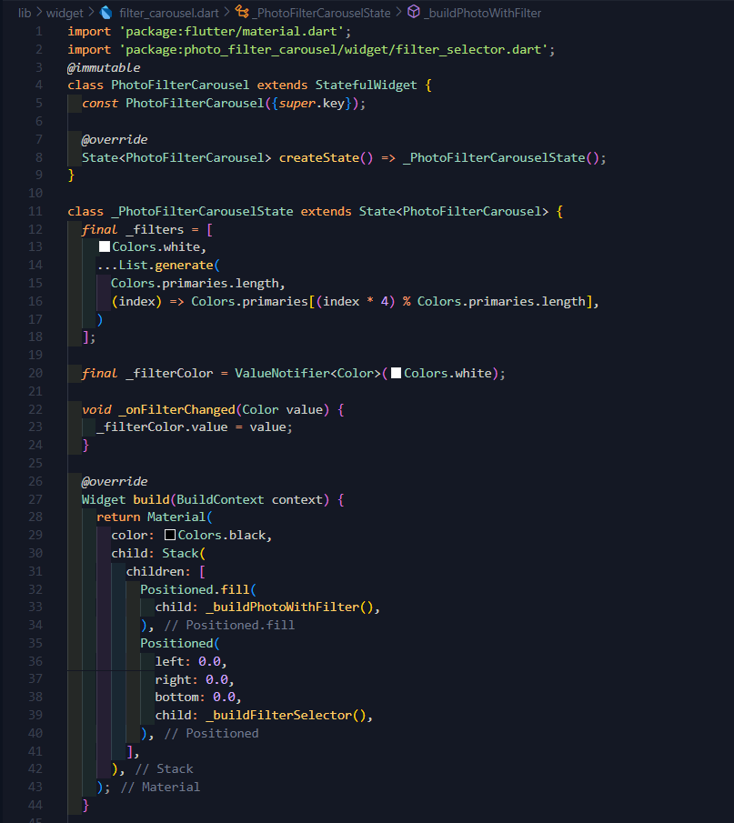
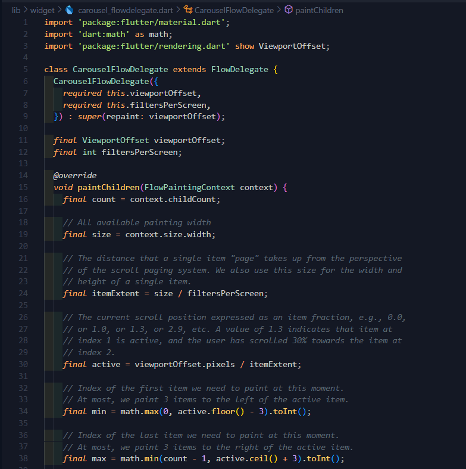
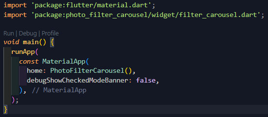
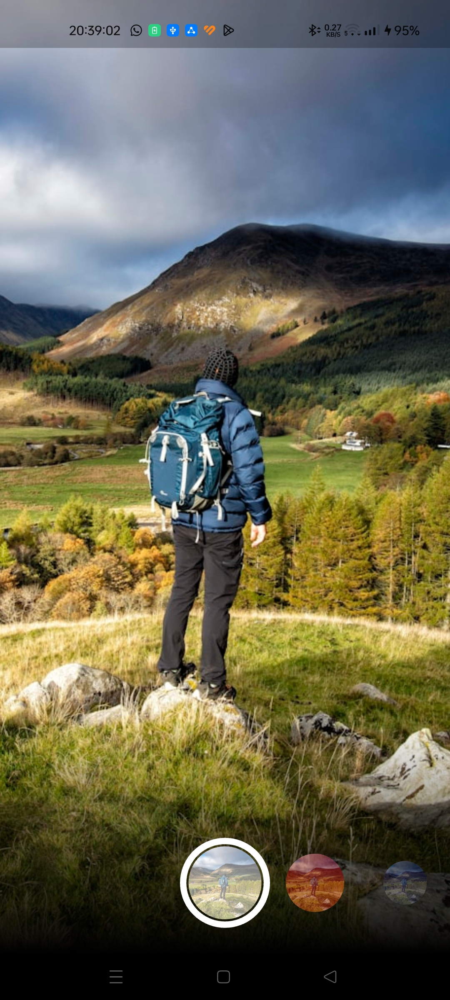

# photo_filter_carousel

Membuat photo filter carousel

2. Buat widget Selector ring dan dark gradient

3. Buat widget photo filter carousel

4. Membuat filter warna - bagian 1

5. Membuat filter warna

6. Implementasi filter carousel

**Hasil:**

